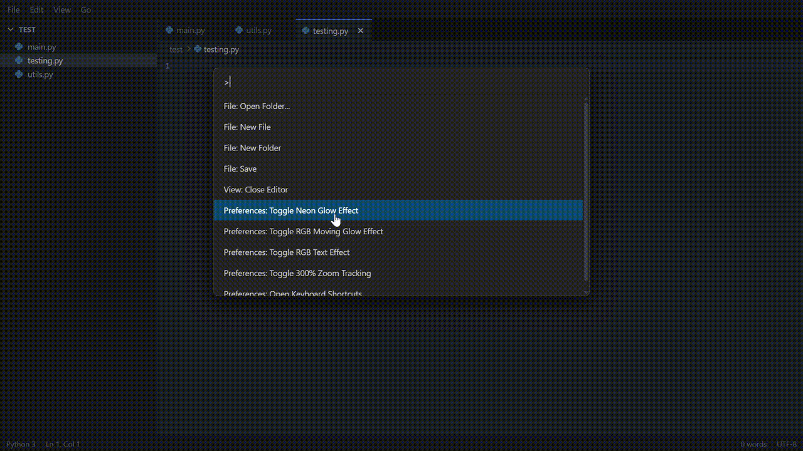

<div align="center">

<br/>

# ⚡ Axiom IDE

### *A blazing-fast, ultra-lightweight Python code editor built for the modern web.*

<br/>

[](https://github.com/adyanthm/axiom)
[](https://github.com/adyanthm/axiom)
[](./LICENSE.md)
[](https://codemirror.net/)

<br/>


<br/>

> **20× faster than VS Code. 14× lighter on memory. Zero compromise on features.**

<br/>

</div>

---

## 🚀 The Speed Difference is Insane

Most developers accept that their editor will hog memory and feel sluggish on large projects. Axiom IDE refuses that compromise.

| | **Axiom IDE** | **Visual Studio Code** |
|---|---|---|
| **Startup Time** | ⚡ Instant | 🐢 ~3–5 seconds |
| **RAM (150k lines)** | **140 MB** | **~2 GB** |
| **CPU Idle** | Near Zero | Noticeable |
| **Bundle Size** | < 1 MB | > 300 MB |
| **Performance** | Native-fast | Electron overhead |

On a **150,000-line Python codebase**, Axiom IDE uses just **140 MB of memory** — compared to VS Code's **~2 GB**. That's not a rounding error. That's a **14× reduction**, achieved by ditching the Electron shell entirely and running as a pure web application with [CodeMirror 6](https://codemirror.net/) at its core.

And it's not just memory — Axiom IDE feels **~20× faster** in everyday use: instant opens, lag-free typing, snappy file switching.

---

## ✨ Features

### 🎨 Visual Effects
Axiom IDE ships with a unique set of editor visual effects that make your coding sessions *actually look cool*. Toggle them any time via the Command Palette or keyboard shortcuts.



| Effect | Shortcut | Description |
|---|---|---|
| **Neon Glow** | `Ctrl+Alt+G` | Adds a static neon glow to the cursor and active text |
| **RGB Glow** | `Ctrl+Alt+R` | Animated, cycling RGB glow that moves through the spectrum |
| **RGB Text** | `Ctrl+Alt+T` | Applies animated rainbow colors to your editor text |
| **300% Zoom Tracking** | `Ctrl+Alt+Z` | Intelligently zooms in around your caret — no manual panning |

All effects are **mutually exclusive** and toggle-able at any time with zero performance overhead.

---

### 🎛️ Command Palette

Everything in Axiom IDE is accessible from the Command Palette — a VS Code-style quick-access panel that puts every action at your fingertips.


| Mode | Shortcut | Usage |
|---|---|---|
| **Command Mode** | `Ctrl+Shift+P` | Run any editor command by typing `>` |
| **File Jump Mode** | `Ctrl+P` | Fuzzy-search and jump to any open file instantly |

Commands available include file operations, visual effects toggles, keybinding settings, and more.

---

### ⌨️ Fully Configurable Keybindings

Axiom IDE ships with a VS Code-style keyboard shortcut panel. Every binding can be **edited inline** — just click the pencil icon or double-click any row, then press your new key combo. Changes apply immediately.

Access it via `Ctrl+K, Ctrl+S` or **View → Keyboard Shortcuts**.

**Default Shortcuts:**

| Command | Keybinding |
|---|---|
| Save File | `Ctrl+S` |
| New File | `Ctrl+N` |
| Close Editor | `Ctrl+W` |
| Open Folder | `Ctrl+K Ctrl+O` |
| Command Palette | `Ctrl+Shift+P` |
| Go to File | `Ctrl+P` |
| Keyboard Shortcuts | `Ctrl+K Ctrl+S` |
| Toggle Neon Glow | `Ctrl+Alt+G` |
| Toggle RGB Glow | `Ctrl+Alt+R` |
| Toggle RGB Text | `Ctrl+Alt+T` |
| Toggle 300% Zoom | `Ctrl+Alt+Z` |
| Find | `Ctrl+F` |
| Find & Replace | `Ctrl+H` |
| Undo | `Ctrl+Z` |
| Redo | `Ctrl+Y` |

---

### 📁 Full File System Access

Axiom IDE uses the native **File System Access API** to open, read, and write files directly from your disk — no file uploads, no copy-paste, no round trips to a server.

- Open any folder from your machine
- Create, rename, and delete files and folders — inline, with a single keystroke
- Unsaved changes are tracked per-tab with VS Code-style dot indicators (●)
- Full undo/redo history persists across file switches

---

## 📊 Speed at Scale

Axiom IDE was built for one reason: **speed at scale.** When working on real-world Python projects with hundreds of thousands of lines of code, the difference becomes impossible to ignore.

- **No Electron.** No Node.js subprocess. No heavyweight runtime overhead.
- **CodeMirror 6** at its core — one of the fastest browser-based editors in existence.
- **Pure ES Modules** with Vite — sub-100ms hot reloads during development.
- **Zero telemetry.** Zero extensions marketplace. Zero bloat.

While VS Code is an extraordinary piece of software, it carries decades of abstraction, a full Electron shell, a Node.js runtime, and dozens of built-in extensions — even when you don't use any of them. Axiom IDE makes different tradeoffs:

- **No remote extension host.** No background indexers eating CPU.
- **No Git integration** running in the background.
- **No settings sync daemon.** No telemetry. Just the editor.
- **Purpose-built for Python** — not a generic editor trying to support 200 languages.

The result: a familiar, VS Code-like experience that starts instantly, runs in your browser, and stays out of your way.

---

## 🛠️ Getting Started

### Prerequisites

- [Node.js](https://nodejs.org/) 18+
- A modern Chromium-based browser (Chrome or Edge 86+) for File System Access API support

### Installation

```bash
# Clone the repository
git clone https://github.com/adyanthm/axiom.git
cd axiom

# Install dependencies
npm install

# Start the dev server
npm run dev
```

Then open `http://localhost:5173` in Chrome or Edge.

### Building for Production

```bash
npm run build
```

Output lands in `./dist`, ready to be served from any static host.

---

## 🧰 Tech Stack

| Layer | Technology |
|---|---|
| **Editor Core** | [CodeMirror 6](https://codemirror.net/) |
| **Language Support** | `@codemirror/lang-python` |
| **Theme** | One Dark Pro (custom variant) |
| **Autocomplete** | `@codemirror/autocomplete` |
| **Search** | `@codemirror/search` |
| **Bundler** | [Vite](https://vitejs.dev/) |
| **File System** | Native File System Access API |
| **Styling** | Vanilla CSS with CSS custom properties |

No React. No Angular. No Vue. No framework overhead — just lean, fast, handcrafted JavaScript.

---

## 🤝 Contributing

Contributions are what keep open-source projects alive. Whether it's a bug report, a feature suggestion, documentation improvement, or a pull request — **it's all appreciated.**

**Please read [CONTRIBUTING.md](./CONTRIBUTING.md) before submitting anything.** It covers the repo structure, how to set up the dev environment, coding conventions, and the PR process.

A few quick notes:
- Open an **[Issue](https://github.com/adyanthm/axiom/issues)** before working on a substantial change, so we can discuss it first.
- Keep PRs focused — one feature or fix per PR.
- Test manually in Chrome/Edge (the File System Access API is not available in Firefox).

---

## 📄 License

Axiom IDE is released under the [MIT License](./LICENSE.md). Use it, fork it, ship it.

---

<div align="center">

Made with ⚡ and a hatred for slow editors.

</div>
