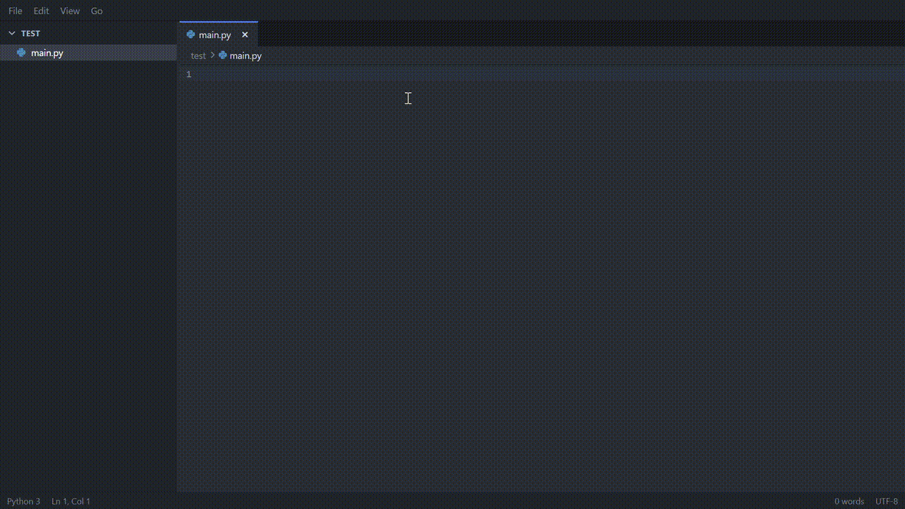
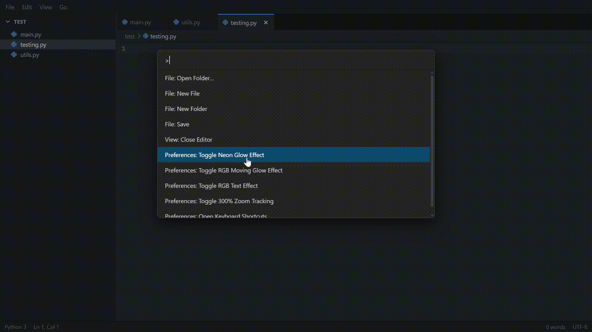
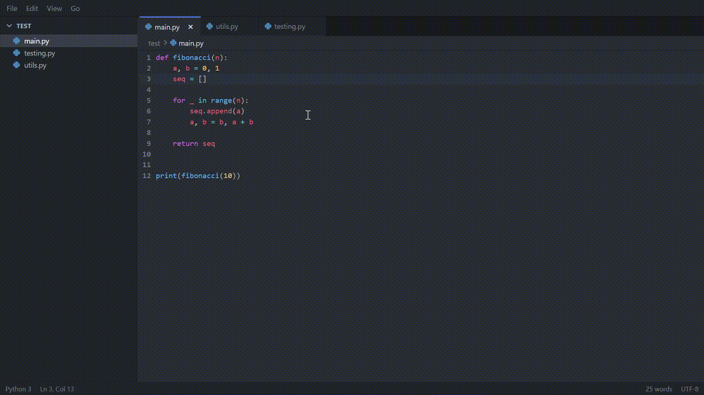

<div align="center">

<br/>


<br/>

# ⚡ Axiom IDE

### *A lightweight, high-performance desktop IDE built with Rust to replace the slow, bloated editors you've been stuck with.*

<br/>

[](https://github.com/adyanthm/axiom-desktop)
[](https://github.com/adyanthm/axiom-desktop)
[](./LICENSE.md)
[](#-free--open-source-software)
[](https://tauri.app/)
[](https://codemirror.net/)

<br/>



<br/>

> **20× faster than VS Code. 14× lighter on memory. Native Rust backend. Zero telemetry. Fully open-source.**

<br/>

[**🚀 Download for Windows, macOS, or Linux**](https://github.com/adyanthm/axiom-desktop/releases/latest)

*Grab the latest stable release and start coding in seconds.*

<br/>

</div>

---

## 📥 Quick Start: Just want to use Axiom?

If you aren't a developer looking to contribute and just want to use the editor, **do not build from source.**

1.  Go to the **[Releases Page](https://github.com/adyanthm/axiom-desktop/releases/latest)**.
2.  Download the installer for your platform:
    *   **Windows**: `.msi` or `.exe`
    *   **macOS**: `.dmg` (Universal binary for Intel & Apple Silicon)
    *   **Linux**: `.AppImage` or `.deb`
3.  Install and run. That's it!

---

## 🚀 Why Axiom?

Most code editors are built on **Electron** — a full Chromium browser + Node.js runtime bundled together. That means hundreds of megabytes of overhead before you even type a single character.

**Axiom takes a fundamentally different approach.** The backend is written entirely in **Rust** using [Tauri](https://tauri.app/), giving you native OS performance for file system operations, terminal emulation, and process management — with none of Electron's memory bloat.

The frontend is powered by [CodeMirror 6](https://codemirror.net/), one of the fastest browser-based editor engines in existence, running inside a lightweight native webview — not a 300 MB Chromium sandbox.

---

## 📊 Axiom vs VS Code — The Numbers

| | **Axiom IDE** | **Visual Studio Code** |
|---|---|---|
| **Backend** | ⚙️ **Native Rust** (Tauri) | 🐢 Electron + Node.js |
| **Startup Time** | ⚡ **Instant** (~200ms) | ~3–5 seconds |
| **RAM (150k LOC project)** | **~140 MB** | **~2 GB** |
| **CPU at Idle** | **Near zero** | Noticeable (extensions, indexers) |
| **App Bundle Size** | **< 10 MB** | **> 300 MB** |
| **File System Access** | **Native Rust `std::fs`** | Node.js `fs` via Electron IPC |
| **Terminal** | **Native PTY** (`portable-pty`) | Node.js `node-pty` |
| **Telemetry** | ❌ **None. Ever.** | Enabled by default |
| **Source Code** | 🟢 **Fully FOSS (MIT)** | Partially open (proprietary builds) |
| **Runtime Overhead** | Lean native webview | Full Chromium browser engine |

On a **150,000-line codebase**, Axiom uses just **~140 MB of RAM** — compared to VS Code's **~2 GB**. That's a **14× reduction**. And because the backend is Rust — not JavaScript running on Node.js — file operations, directory scanning, and terminal I/O happen at **native speed** with zero garbage collection pauses. Furthermore, Axiom processes multi-megabyte files smoothly by debouncing expensive structural calculations and virtually truncating ultra-long lines to prevent browser thread freeze.

---

## 🖥️ Integrated Terminal

Axiom ships with a **real, interactive OS terminal** — not a fake shell or output panel. It uses [`portable-pty`](https://docs.rs/portable-pty) in the Rust backend to spawn a true PTY process (PowerShell on Windows, your default `$SHELL` on macOS/Linux), streamed to an [xterm.js](https://xtermjs.org/) frontend.


| Feature | Details |
|---|---|
| **Shell** | PowerShell (Windows), bash / zsh / fish (macOS / Linux) |
| **Toggle** | `Ctrl+Shift+`` ` or Command Palette → `View: Toggle Terminal` |
| **Resize** | Drag the terminal divider — auto-reflows content |
| **Run Files** | `F5` or `Ctrl+Shift+R` — auto-saves and runs the active file |
| **Supported Runners** | Python (`python`), JavaScript (`node`), Rust (`rustc`) |

The terminal opens in your **project's working directory** and behaves exactly like a native terminal window — because under the hood, it *is* one.

---

## 🔥 Live Server

Axiom includes a built-in, lightning-fast **Live Server** for web development. No more manual browser refreshes — your changes are pushed instantly via a native Rust SSE (Server-Sent Events) backend.


| Feature | Details |
|---|---|
| **Instant Reload** | HTML files automatically refresh in the browser the millisecond you save (`Ctrl+S`) |
| **Native Backend** | Powered by `axum` in Rust — handles static files with zero overhead |
| **Port Fallback** | Automatically finds the next available port if your default is in use |
| **Customizable** | Set your preferred port once and Axiom remembers it |
| **How to Start** | Open any `.html` file and hit **Run (`F5`)** |

---

## ✨ Features

### 🌍 Multi-Language Support

Axiom is **not** a single-language editor. It ships with built-in syntax highlighting, language detection, and autocomplete for **17 languages** out of the box:

| Language | Extensions | Language | Extensions |
|---|---|---|---|
| **Python** | `.py` | **Rust** | `.rs` |
| **JavaScript** | `.js` | **TypeScript** | `.ts` |
| **JSX** | `.jsx` | **TSX** | `.tsx` |
| **HTML** | `.html`, `.htm` | **CSS** | `.css` |
| **SCSS** | `.scss` | **Less** | `.less` |
| **JSON** | `.json` | **Markdown** | `.md` |
| **C** | `.c`, `.h` | **C++** | `.cpp`, `.cc`, `.cxx` |
| **Java** | `.java` | **PHP** | `.php` |
| **Vue** | `.vue` | | |

Languages are **lazy-loaded** — only the parser for the file you open gets imported. Zero wasted resources.

---

### ⚡ Emmet Abbreviation Expansion

Axiom ships with [Emmet](https://emmet.io/) support — the industry-standard toolkit for writing HTML and CSS blazing fast using short abbreviations that expand into full markup on `Tab`.

| Action | How |
|---|---|
| **Expand abbreviation** | Type any Emmet shorthand and press `Tab` |
| **Visual tracker** | Emmet highlights and previews the abbreviation as you type |
| **Scoped to markup/style languages** | Only active in `.html`, `.htm`, `.css`, `.scss`, `.less`, `.jsx`, `.tsx`, `.vue`, `.php` |

**Examples:**

| You type | After `Tab` |
|---|---|
| `div.container>ul>li*3` | Full nested `<div>` → `<ul>` → 3 `<li>` elements |
| `a[href=#]` | `<a href="#"></a>` |
| `m10` (in CSS) | `margin: 10px;` |
| `bgc:#fff` (in CSS) | `background-color: #fff;` |

In all other languages (Python, Rust, JS, etc.) `Tab` behaves as normal indentation — Emmet never fires.

---

### 🔍 Super Fast File Search

Axiom's Command Palette doubles as a **blazing-fast fuzzy file finder**. Hit `Ctrl+P` and start typing — it instantly searches across every file in your project tree with zero delay.

| Mode | Shortcut | What It Does |
|---|---|---|
| **File Search** | `Ctrl+P` | Fuzzy-search any file in the project by name or path |
| **Command Mode** | `Ctrl+Shift+P` | Run any editor command (type `>`) |

- **Instant results** — no indexing delay, no background workers
- **Path-aware** — search by filename *or* directory path
- **Keyboard navigable** — arrow keys + Enter to open
- Shows file icons and relative paths for every result

---

### 🎨 Visual Effects

Axiom ships with a unique set of editor visual effects that make your coding sessions *actually look cool*. Toggle them any time via the Command Palette or keyboard shortcuts.



| Effect | Shortcut | Description |
|---|---|---|
| **Neon Glow** | `Ctrl+Alt+G` | Adds a static neon glow to the cursor and active text |
| **RGB Glow** | `Ctrl+Alt+R` | Animated, cycling RGB glow that moves through the spectrum |
| **RGB Text** | `Ctrl+Alt+T` | Applies animated rainbow colors to your editor text |
| **300% Zoom Tracking** | `Ctrl+Alt+Z` | Intelligently zooms in 3× around your caret — no manual panning |
| **Editor Zoom** | `Ctrl` + `+`/`-`/`0` or `Scroll` | Native font-size scaling for code — glyphs re-rasterise to stay razor-sharp |
| **UI Scale** | `Ctrl+Shift` + `+`/`-`/`0` | Scales the entire IDE interface (Sidebar, Menus, Dialogs) via CSS constraints perfectly |

All effects are **mutually exclusive** and toggle-able at any time with zero performance overhead.

---

### 🎛️ Command Palette

Everything in Axiom is accessible from the Command Palette — a VS Code-style quick-access panel that puts every action at your fingertips.



Commands available include file operations, visual effects toggles, terminal control, keybinding settings, and more. No mouse required.

---

### ⌨️ Fully Configurable Keybindings

Axiom ships with a VS Code-style keyboard shortcut panel. Every binding can be **edited inline** — just click the pencil icon or double-click any row, then press your new key combo. Changes apply immediately.

Access it via `Ctrl+K, Ctrl+S` or **View → Keyboard Shortcuts**.

**Default Shortcuts:**

| Command | Keybinding |
|---|---|
| Save File | `Ctrl+S` |
| New File | `Ctrl+N` |
| Open File | `Ctrl+O` |
| Open Folder | `Ctrl+K Ctrl+O` |
| Command Palette | `Ctrl+Shift+P` |
| Go to File | `Ctrl+P` |
| Next / Previous Tab | `Ctrl+Tab` / `Ctrl+Shift+Tab` |
| Toggle Terminal | `` Ctrl+Shift+` `` |
| Run File | `F5` / `Ctrl+Shift+R` |
| **Start / Continue Debugger** | **`F5`** (Python files) |
| **Step Over** | **`F10`** |
| **Step Into** | **`F11`** |
| **Step Out** | **`Shift+F11`** |
| **Stop Debugger** | **`Shift+F5`** |
| Keyboard Shortcuts | `Ctrl+K Ctrl+S` |
| Find | `Ctrl+F` |
| Find & Replace | `Ctrl+H` |
| Toggle Neon Glow | `Ctrl+Alt+G` |
| Toggle RGB Glow | `Ctrl+Alt+R` |
| Toggle RGB Text | `Ctrl+Alt+T` |
| Toggle 300% Zoom Tracking | `Ctrl+Alt+Z` |
| Zoom In/Out (Editor Font) | `Ctrl+=` / `Ctrl+-` |
| Reset Zoom (Editor Font) | `Ctrl+0` |
| Scale Up/Down UI | `Ctrl+Shift+=` / `Ctrl+Shift+-` |
| Reset UI Scale | `Ctrl+Shift+0` |
| Change Live Server Port | (Command Palette) |
| Undo / Redo | `Ctrl+Z` / `Ctrl+Y` |

---

### 📁 Native File System Access

Axiom uses Rust's native `std::fs` via Tauri commands to read, write, and manage files directly on disk — no Node.js, no Electron IPC overhead, no file upload workarounds.

- **Open any folder** from your machine as a project
- **Create, rename, and delete** files and folders — inline, with context menus or keyboard shortcuts
- **Drag & drop** files between directories in the explorer
- **Unsaved changes** tracked per-tab with VS Code-style dot indicators (●)
- **Full undo/redo** history persists across file switches
- **Recent projects** remembered across sessions

---

### 🐛 Python Debugger

Axiom ships a **fully integrated Python debugger**, powered by [debugpy](https://github.com/microsoft/debugpy) and the [Debug Adapter Protocol (DAP)](https://microsoft.github.io/debug-adapter-protocol/). No extensions, no configuration files, no setup — just open a `.py` file and press `F5`.


| Feature | Details |
|---|---|
| **Start Debugging** | `F5` or the **Bug icon** (🐛) in the editor header |
| **Breakpoints** | Click in the gutter (left of line numbers) to place or remove a red dot |
| **Step Over** | `F10` — run the current line, stay in the same scope |
| **Step Into** | `F11` — dive into the function call on the current line |
| **Step Out** | `Shift+F11` — finish the current function and go up one frame |
| **Continue** | `F5` — resume until the next breakpoint |
| **Stop** | `Shift+F5` — terminate the process immediately |
| **Variables Panel** | Inspect all local variables — Name, Type, and Value shown live |
| **Edit Variables** | **Double-click any value** to modify it in the running process |
| **Call Stack** | Full stack frame list — see exactly where you are in the call chain |
| **Console Output** | All `print()` output and `stderr` stream live into the Console tab |
| **Active Line** | The currently paused line is highlighted in amber in the editor |

### The Debug Panel

When a debug session starts, a dedicated **PyCharm-style panel** slides in at the bottom of the editor with three tabs:

- **Variables** — Live local variable inspector. Double-click any value to edit it directly in the running Python process.
- **Console** — Real-time stdout/stderr output from your script.
- **Call Stack** — Every stack frame, top to bottom. The active frame is highlighted in blue.

The panel is resizable (drag the top edge), and a color-coded status badge in the header shows `RUNNING` → `PAUSED` → `STOPPED` as your session progresses.

---

## 🏃 Run Code Directly

Hit `F5` or `Ctrl+Shift+R` to **auto-save and execute** the current file in the integrated terminal:

| File Type | Action |
|---|---|
| `.py` | **Launch Python Debugger** (if breakpoints set) or `python` in terminal |
| `.js` | `node` |
| `.rs` | `rustc` → execute |
| `.html` | Open in **Live Server** (auto-reload on save) |

> **Tip:** For Python files, `F5` always launches the full debugger with your breakpoints — no separate debug command needed.

---

## 🛡️ Free & Open-Source Software

Axiom is **100% FOSS**, released under the [MIT License](./LICENSE.md).

- ✅ **No telemetry** — zero data collection, zero phone-home, zero analytics
- ✅ **No proprietary builds** — what you see on GitHub is what you run
- ✅ **No extension marketplace** — no walled garden, no vendor lock-in
- ✅ **No cloud logic** — works fully offline (Note: file icons are fetched from VSCode Material Icon Theme via CDN)
- ✅ **Fork it, modify it, ship it** — the MIT license means you can do whatever you want

We believe development tools should respect your privacy, your machine, and your freedom. No exceptions.

---

## ⚙️ Highly Optimized Architecture

Axiom is engineered for performance at every layer:

| Layer | Why It's Fast |
|---|---|
| **Backend (Rust)** | Native binary — no interpreter, no GC, no runtime overhead |
| **File System** | Direct `std::fs` calls — zero serialization, zero IPC translation layers |
| **Terminal** | Native PTY via `portable-pty` — true OS-level process, not a JS wrapper |
| **Editor Engine** | CodeMirror 6 — virtual rendering, incremental parsing, sub-ms updates |
| **Large File Safety** | O(1) dirty checking via transaction tracking. Visual truncation for lines >10,000 chars preventing DOM hangs |
| **Language Parsers** | Lazy-loaded on demand — only import what you actually use |
| **Bundler** | Vite — sub-100ms hot reloads during development, tree-shaken production builds |
| **Styling** | Pure CSS with custom properties — no runtime CSS-in-JS overhead |
| **Dependencies** | Minimal — no React, no Angular, no Vue, no framework overhead |

### What Axiom Deliberately Does *Not* Have

These are intentional omissions to keep the editor lean:

- ❌ No Electron runtime (saves ~300 MB)
- ❌ No background extension host (saves CPU)
- ❌ No built-in Git client (saves memory)
- ❌ No settings sync daemon (saves network)
- ❌ No remote development server (saves complexity)
- ❌ No telemetry of any kind (saves your privacy)

---

## 🛠️ Getting Started

### Prerequisites

- [Node.js](https://nodejs.org/) 18+
- [Rust](https://www.rust-lang.org/tools/install) (latest stable)
- Platform-specific Tauri dependencies — see the [Tauri prerequisites guide](https://v2.tauri.app/start/prerequisites/)

### Installation

```bash
# Clone the repository
git clone https://github.com/adyanthm/axiom-desktop.git
cd axiom

# Install frontend dependencies
npm install

# Run in development mode (launches the native desktop app)
npm run tauri dev
```

### Building for Production

```bash
# Build the optimized native binary
npm run tauri build
```

The output binary will be in `src-tauri/target/release/` — a single, self-contained executable.

### Web-Only Mode (No Rust Required)

If you just want to run the editor frontend in a browser (without the terminal or native file system features):

```bash
npm run dev
# Open http://localhost:5173 in Chrome or Edge
```

---

## 🧰 Tech Stack

| Layer | Technology |
|---|---|
| **Native Backend** | [Rust](https://www.rust-lang.org/) + [Tauri 2](https://tauri.app/) |
| **Terminal PTY** | [`portable-pty`](https://docs.rs/portable-pty) (Rust) + [xterm.js](https://xtermjs.org/) |
| **Editor Core** | [CodeMirror 6](https://codemirror.net/) |
| **Language Support** | `@codemirror/lang-*` (17 languages) |
| **Emmet** | [`@emmetio/codemirror6-plugin`](https://github.com/emmetio/codemirror6-plugin) |
| **Theme** | One Dark Pro (custom variant) |
| **Autocomplete** | `@codemirror/autocomplete` |
| **Search** | `@codemirror/search` |
| **Bundler** | [Vite](https://vitejs.dev/) |
| **File System** | Rust `std::fs` via Tauri IPC |
| **Persistent Storage** | `tauri-plugin-store` |
| **Native Dialogs** | `tauri-plugin-dialog` |
| **Icons** | [Material Icon Theme](https://github.com/PKief/vscode-material-icon-theme) (via JSDelivr) |
| **UI Icons** | Font Awesome 6 |
| **Styling** | Vanilla CSS with CSS custom properties |

No React. No Angular. No Vue. No Electron. Just Rust + lean, handcrafted JavaScript.

---

## 🤝 Contributing

Axiom is open-source and contributions are what keep it alive. Whether it's a bug report, a feature suggestion, documentation improvement, or a pull request — **it's all appreciated.**

**Please read [CONTRIBUTING.md](./CONTRIBUTING.md) before submitting anything.** It covers the repo structure, how to set up the dev environment, coding conventions, and the PR process in detail.

Quick notes:
- Open an **[Issue](https://github.com/adyanthm/axiom-desktop/issues)** before working on a substantial change
- Keep PRs focused — one feature or fix per PR
- Test on your platform (Windows / macOS / Linux)

---

## 📄 License

Axiom IDE is released under the [MIT License](./LICENSE.md). Use it, fork it, ship it — no strings attached.

---

<div align="center">

Made with ⚡ and a hatred for slow editors.

**[⭐ Star this repo](https://github.com/adyanthm/axiom-desktop)** if Axiom made your day a little faster.

</div>
